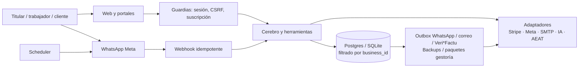

# Guía técnica para ingeniería — Bynoesis

> **Propósito.** Documento de entrada para una persona de ingeniería que necesite entender Bynoesis de extremo a extremo: web, datos, cerebro, automatizaciones, WhatsApp, seguridad y dependencias externas.
>
> **Foto del código:** 20-07-2026 · esquema 33 · el candidato de repositorio es la referencia de producto. Para números, publicación y validaciones externas vigentes consulta también [`project-state.json`](../project-state.json). Este documento explica el diseño; no sustituye esa fuente de estado.

## 1. Qué es el sistema

Bynoesis es un SaaS multiempresa para autónomos y pequeños negocios de servicios. La intención de producto es que el profesional haga su trabajo y Bynoesis se ocupe del ruido administrativo: clientes, agenda, proyectos, documentos, facturas, cobros, equipo y gestoría.

No es un chatbot aislado ni un dashboard financiero genérico. Es una aplicación operativa con tres entradas equivalentes:

- **Web:** panel del titular y portales privados para cliente, trabajador y gestoría.
- **WhatsApp:** conversación y recepción de texto, audio, foto y PDF.
- **Automatizaciones:** tareas programadas que preparan o envían acciones solo bajo reglas autorizadas por el titular.

La regla transversal es: **Bynoesis puede leer, calcular y preparar; dinero, fiscalidad, emisión definitiva, envíos sensibles y borrados irreversibles requieren confirmación o una regla explícitamente autorizada.**



## 2. Estado real: construido vs. conectado

| Área | En el código | Falta para declararlo operativo en producción |
|---|---|---|
| Panel, API, onboarding, portales y reglas locales | Construidos y cubiertos por la suite | Prueba con negocios piloto |
| Postgres y migraciones | Implementados; CI aplica el esquema y realiza humo contra Postgres | Verificación posterior a cada despliegue (`/ready`) |
| WhatsApp Cloud API | Webhook firmado, outbox, reintentos, plantillas y flujos de entrada | Número, app Meta, plantillas aprobadas y prueba E2E real |
| Stripe | Checkout, portal, precios y webhook idempotente | Seis `price_id`, claves, IVA del Checkout y escenarios reales |
| Google OAuth | Flujo implementado si hay credenciales | Cliente OAuth y callback real en producción |
| IA privada/externa | Enrutamiento y adaptador OpenAI-compatible | Servicio/modelo, evaluación, límites y observabilidad real |
| SMTP | Adaptador, outbox durable y reintentos de avisos | Credenciales y prueba de entregabilidad |
| Calendario | Feed ICS privado y revocable | Validar suscripción real; OAuth bidireccional solo si el piloto lo exige |
| Banco | Importación CSV, deduplicación y propuesta confirmable | Validar extractos reales; PSD2 queda fuera del MVP |
| Veri*Factu/AEAT | Registro, QR, XML, cola y cliente de remisión | Certificado, entorno AEAT y validación fiscal externa |
| Backups externos | Proceso y soporte S3-compatible | Restauración real auditada |

No se debe presentar una fila de la segunda columna como “integración activa” hasta completar la tercera. Las pendientes exactas viven en [`Tareas-vivas.md`](../Tareas-vivas.md) y las credenciales, callbacks y pruebas en [`Conectar-APIs.md`](../03-whatsapp-e-integraciones/Conectar-APIs.md).

## 3. Arranque local y comprobaciones básicas

```powershell
py -m venv .venv
.\.venv\Scripts\Activate.ps1
pip install -e .
Copy-Item .env.example .env  # solo si se van a configurar opciones externas
noesis-web                   # http://127.0.0.1:8000
```

- Demo comercial dentro del producto, si está activado `NOESIS_SEED_DEMO`: dos
  accesos reales —autónomo y gestoría—, una cartera multiempresa y un portal de
  cliente, todos con datos ficticios y escritura bloqueada. Credenciales y
  activación en [`Demo-comercial.md`](../01-producto/Demo-comercial.md). En local se prepara con
  `python -m noesis.demo`.
- CLI de conversación: `python -m noesis`.
- Sin `DATABASE_URL`, se usa SQLite; con `DATABASE_URL`, Postgres.
- Sin API de IA, el cerebro determinista local sigue funcionando.

Antes de tocar una funcionalidad conviene ejecutar:

```powershell
python -m unittest discover -s tests -p "test_*.py"
python -m noesis.migrations upgrade
noesis-doctor --strict
```

`/health` confirma que responde el proceso. `/ready` además confirma que la base de datos y la versión de migración esperada están disponibles.

## 4. Organización del código

```text
src/noesis/
├── web/
│   ├── server.py             # FastAPI, middleware, arranque y routers
│   ├── routers/              # HTML/API/webhooks por dominio
│   ├── templates/            # una plantilla por pantalla
│   ├── static/               # CSS, JS, PWA y Chart.js local
│   ├── chat.py               # parte diario y acompañamiento contextual
│   ├── whatsapp.py           # webhook, entrada y cola saliente durable
│   ├── scheduler.py          # automatizaciones periódicas
│   └── gestoria.py           # paquetes y entregas a asesoría
├── db.py                     # frontera única de datos multiempresa
├── migrations.py             # SQLite/Postgres, versión 31
├── banking.py                # CSV bancario y propuestas locales de conciliación
├── nlu.py                    # órdenes rutinarias por reglas locales
├── internal_brain.py         # borradores explicables de comunicaciones
├── agent.py                  # IA privada, compatible y Anthropic
├── tools.py                  # acciones disponibles para el cerebro
├── documents/                # archivo, OCR, clasificación y revisión
├── adapters/                 # contratos con proveedores externos
├── verifactu.py              # registro fiscal, huella, QR y XML
└── readiness.py              # diagnóstico de salida a piloto
```

Las rutas no acceden a SQL directamente. Una ruta valida la petición y llama a `db.py` o a un servicio de dominio; `db.py` aplica de nuevo el `business_id`. Los adaptadores aíslan los SDK/protocolos externos para poder cambiar de proveedor sin contaminar el producto.

## 5. Navegación y pantallas web

### Sitio público y adquisición

| Ruta | Uso | Implementación relevante |
|---|---|---|
| `/` | Landing con propuesta de valor, precios mensual/anual y muestra interactiva | `routers/pages.py`, `templates/landing.html`, `static/public-site.js` |
| `/producto`, `/precios`, `/equipo`, `/preguntas` | Páginas públicas con contenido específico, no clones del panel | `templates/site_*.html` |
| `/login`, `/recuperar`, `/restablecer` | Acceso, recuperación y sesión | `routers/account.py`, `web/auth.py` |
| `/auth/google` y callback | OAuth Google opcional | solo aparece/funciona con las dos credenciales configuradas |
| `/onboarding/*` | Alta, elección de plan, perfil operativo y conexión inicial | `routers/account.py` |

La muestra de la landing usa una empresa ficticia y no consulta ni modifica datos de una cuenta. Es una explicación visual del producto, no un segundo backend.

### Panel privado del titular

Todas estas pantallas siguen la convención `/b/{business_id}/{apartado}`. La sesión debe pertenecer al mismo negocio que el identificador de la URL; de lo contrario se redirige o responde 403.

| Apartado | Para qué sirve | Datos/acciones clave |
|---|---|---|
| `resumen` | Parte de hoy y puesta en marcha | prioridad, agenda, dinero, cobros, progreso y lectura de Bynoesis |
| `tesoreria`, `ingresos`, `costes`, `analisis`, `impuestos` | Entender caja, rentabilidad y obligaciones | series, P&G, previsión, pendientes, costes e informes CSV |
| `clientes`, `crm`, `productos` | Relación comercial | clientes, leads, preferencias, catálogo, importación y portal |
| `agenda` | Trabajos/visitas y planificación operativa | trabajos, asignaciones, estado de campo y feed ICS privado |
| `proyectos` | Obras o servicios de mayor alcance | presupuesto, miembros, tareas, horas, costes, avance y borrador de factura |
| `facturas`, `presupuestos`, `cobros` | Documentos comerciales y cobro | PDF, rectificativas, pagos parciales, portal y conciliación CSV confirmable |
| `equipo` | Personas y productividad | alta, asignación, enlaces de trabajador y fichajes |
| `documentos` | Entrada y archivo de papeles | subida, clasificación, OCR, proveedor, factura recibida y conversión a gasto |
| `asistente` | Conversación, audio, memoria y permisos | historial, contexto de negocio y acciones preparadas |
| `ajustes` | Preferencias y control del negocio | IA, memoria, automatizaciones, fiscalidad y conexiones utilizables; el diagnóstico técnico solo vive en `/admin` |
| `suscripcion` | Gestión del plan | checkout/portal de Stripe o flujo de prueba si Stripe no está configurado |

El acompañante no es una página aislada: `base.html` recibe un `page_brief` en cada sección. `web/chat.py` genera el motivo, la cifra relevante y el siguiente paso para que la ayuda sea contextual a la tarea de esa pantalla.

### Portales externos con token

| Ruta | Destinatario | Qué puede hacer |
|---|---|---|
| `/p/{token}` | Cliente | aceptar/rechazar presupuesto, consultar/descargar factura y confirmar finalización |
| `/t/{token}` | Trabajador | PIN, fichar, recibir trabajos, reconocerlos, subir materiales/fotos/actualizaciones y cerrar un trabajo |
| `/g/{token}` | Gestoría | solicitar documentación y descargar paquetes versionados |

Los tokens reducen fricción, pero son enlaces privados: no se deben registrar ni reenviar en soporte. Las respuestas llevan cabeceras `no-store` y, en el portal de trabajador, la política de permisos permite geolocalización solo en ese contexto.

## 6. Modelo de datos y reglas que no se deben romper

`db.py` es la frontera de persistencia. SQLite es el fallback local y Postgres la base operativa de producción. Las migraciones viven en `migrations.py` y deben ser reversibles cuando sea viable.

### Identidad y aislamiento

1. Un usuario tiene un negocio titular.
2. Casi todas las entidades operativas llevan `business_id`.
3. Las rutas comprueban sesión + negocio en `web/deps.py`.
4. `db.py` repite el filtro y usa relaciones compuestas `(business_id, id)` donde hace falta impedir vínculos cruzados.

Nunca se debe añadir una lectura/escritura de cliente, factura, proyecto, documento, trabajo o trabajador que reciba un id sin filtrar también por `business_id`.

### Entidades y recorridos principales

```text
Cliente → presupuesto → trabajo ─┬→ proyecto → miembros/tareas/costes
                                 ├→ fichaje/evidencia/materiales
                                 └→ borrador de factura → factura → pagos/cobro

Documento → clasificación → borrador revisable → gasto o factura recibida
```

- Las horas provienen de fichajes inmutables; no se duplican como un coste manual.
- El margen del proyecto se deriva de presupuesto menos costes/hora/gastos reales.
- Los pagos viven en un ledger (`invoice_payments`); pendiente y estado se derivan, no se escriben a mano. La factura se bloquea al añadir un cobro para evitar sobrecobro concurrente.
- La emisión de factura es atómica e idempotente, congela cabecera y líneas y conserva numeración por negocio/serie/año.
- Las facturas emitidas no se eliminan ni se renumeran. Una rectificación crea otra factura, manteniendo el original.
- En modo Veri*Factu se añade un registro de alta append-only y encadenado con huella; no se borra para “corregir” la historia fiscal. Las anulaciones aceptadas crean otro registro inmutable enlazado al alta y entran en la misma cadena cronológica.

## 7. Flujos funcionales que debe conocer una persona de ingeniería

### 7.1 Alta, sesión y suscripción

1. El usuario elige probar 14 días o contratar un plan mensual/anual y crea cuenta por contraseña o, si está configurado, Google OAuth.
2. Onboarding recoge negocio, sector, equipo, provincia, objetivo, nivel de explicación y preferencia de IA.
3. Configura fiscalidad, plantilla y vencimiento de factura, datos de cobro, recordatorios, informes, gestoría y WhatsApp. Estas preferencias se persisten y se aplican a facturas y automatizaciones.
4. Quien prueba entra al panel sin tarjeta. Quien contrata llega a la revisión del plan y Stripe genera checkout cuando está configurado; su webhook firmado activa la suscripción de forma idempotente.
5. El catálogo es 29/49/99 € + IVA al mes, con anual de 11 meses cobrados. Si la prueba expira, se cancela o hay impago, la cuenta conserva lectura, exportación y baja, pero queda en **modo consulta**.

El modo consulta se fuerza en servidor, no solo con botones ocultos: web, API, WhatsApp, scheduler y colas cancelan o rechazan mutaciones (HTTP 402 en API).

### 7.2 Cliente → trabajo/proyecto → factura → cobro

1. Se crea o importa el cliente; se pueden guardar preferencias de comunicación.
2. Se crea un presupuesto, un trabajo de agenda o un proyecto con presupuesto.
3. El trabajo se asigna a trabajadores. Campo puede aportar fichaje, materiales, actualizaciones, fotos, evidencia y cierre/conformidad.
4. Las entradas de coste y horas actualizan el detalle de rentabilidad del proyecto.
5. Desde el trabajo se prepara un borrador de factura; el titular revisa, emite y puede enviar por el canal permitido.
6. Los cobros se registran como pagos parciales o completos. Bynoesis identifica pendientes y puede preparar un seguimiento, nunca ejecutarlo sin permiso.

### 7.3 Entrada documental universal

El mismo servicio (`documents/service.py`) se usa desde la web y WhatsApp:

1. Guarda primero el fichero y sus metadatos en almacenamiento persistente.
2. Ejecuta OCR/clasificación local cuando está disponible. En PDF intenta primero
   la capa de texto y, si está vacía, rasteriza de forma acotada con PDFium y lee con
   Tesseract; puede usar extracción externa solo si el negocio lo ha autorizado y
   respeta el límite diario.
3. Propone tipo: ticket/gasto, factura recibida, presupuesto, contrato, albarán, proveedor o documento general.
4. Si hay efecto contable, crea un **borrador**. Solo una revisión/confirmación crea el gasto o registra la factura recibida y enlaza el documento en la misma transacción.

Así una foto mal leída no contamina las cuentas automáticamente.

### 7.4 Equipo y trabajo de campo

El titular da de alta el trabajador y genera un enlace/token de trabajador. El trabajador puede validar PIN, fichar, consultar su día, reconocer asignaciones, añadir materiales/actualizaciones/fotos y cerrar una visita. Los fichajes y su integridad se usan como fuente de horas del proyecto.

### 7.5 Gestoría

Bynoesis agrupa emitidas, gastos, recibidas y originales en paquetes por período. El paquete tiene manifiesto, huella y versionado: si no cambió nada se conserva la versión; si cambió una fuente se crea la siguiente. El portal de gestoría puede pedir documentación y descargar el paquete sin entrar en el panel del autónomo.

### 7.6 Calendario y conciliación sin API obligatoria

Agenda puede crear un token aleatorio y exponer `/cal/{token}.ics`. El enlace es de
solo lectura, no indexable y revocable: rotarlo invalida inmediatamente el anterior.
Google Calendar, Apple Calendar u Outlook pueden suscribirse a él sin que Bynoesis
almacene credenciales de esos servicios.

Cobros admite CSV bancarios comunes. `banking.py` normaliza fecha, importe, concepto,
contraparte y referencia, y `db.py` impide duplicados por huella dentro de cada
negocio. Una propuesta puede apoyarse en importe, número de factura y cliente, pero
solo el endpoint de confirmación crea `invoice_payments`. Importar nunca mueve dinero
ni marca una factura como cobrada automáticamente.

## 8. Cerebro y acompañamiento de Bynoesis

### Orden de resolución

```text
Mensaje web o WhatsApp
  → nlu.py (reglas y cálculos locales)
  → internal_brain.py (borradores explicables)
  → IA privada OpenAI-compatible, si existe
  → proveedor OpenAI-compatible autorizado, si existe
  → Anthropic autorizado como respaldo
  → respuesta local honesta
```

- `nlu.py` entiende órdenes rutinarias y extrae fechas, importes, IVA/IRPF, clientes y acciones sin llamada externa.
- `internal_brain.py` construye mensajes de cobro, presupuesto, cita, gestoría o comunicaciones personalizadas a partir de hechos de base de datos. Preparar no equivale a enviar: la entrega necesita `SÍ/NO` o una regla aprobada.
- `agent.py` añade modelos avanzados y herramientas. El servidor valida las herramientas, argumentos, sesión, negocio y permisos: el modelo no gobierna accesos ni acciones irreversibles.
- La memoria persistente es explícita, visible, editable y borrable desde Ajustes; diferencia observación de dato confirmado.
- Si una herramienta de escritura pudo ejecutarse y un proveedor falla, no se continúa con otro modelo de forma ciega: se pide revisar la actividad reciente para evitar duplicados.

La IA avanzada externa requiere consentimiento por negocio y reserva de crédito de forma atómica. Las reglas, los cálculos y el servicio privado no consumen dicho crédito. Configurar un endpoint compatible (`/v1/chat/completions`) permite usar Ollama, llama.cpp o vLLM sin introducir un SDK de proveedor.

## 9. WhatsApp: diseño, flujos y operación

### Conexión de un negocio

En Ajustes/Onboarding se genera un código de vinculación. El propietario lo envía desde el número que usará con Bynoesis. `whatsapp.py` asocia ese teléfono al `business_id`; no se deduce el negocio por un texto libre.

Para trabajadores existe una vinculación específica. Tras enlazarse, los comandos de jornada y consulta de plan se resuelven contra el trabajador autorizado, no contra el titular.

### Entrada desde Meta

`POST /webhook/whatsapp`:

1. limita el tamaño del cuerpo y comprueba `x-hub-signature-256` con `WHATSAPP_APP_SECRET`;
2. deduplica cada id de Meta en la tabla de eventos de webhook;
3. si una entrega previa quedó `processing`, devuelve 503 para que Meta reintente;
4. identifica mensajes, estados de entrega y teléfono remitente;
5. bloquea operaciones cuando la suscripción está inactiva;
6. procesa el contenido y solo marca el evento como completo al terminar todos sus efectos.

| Entrada | Resultado |
|---|---|
| Texto | reglas/IA y respuesta por la outbox |
| Nota de voz | transcripción por API o `faster-whisper` local; una orden sensible se confirma con SÍ/NO |
| Foto | se guarda como documento, se intenta lectura y se pregunta antes de crear gasto |
| PDF | lee texto digital o aplica OCR privado si está escaneado; se archiva, clasifica y, si parece factura recibida, propone el registro |
| SÍ / NO | ejecuta o descarta la acción pendiente del propio teléfono |
| Estado Meta | actualiza `sent`, `delivered`, `read` o error de salida |

### Salida y fiabilidad

Ningún módulo hace depender la entrega de una única llamada HTTP síncrona. Primero se inserta una fila en la **outbox durable**; después se intenta enviar. La cola:

- reclama una fila con bloqueo para coordinar réplicas de Postgres;
- usa claves de idempotencia para no duplicar un aviso;
- verifica de nuevo que la suscripción permite actuar;
- reintenta con backoff exponencial (base 30 s, máximo 1 h, 6 intentos por defecto);
- conserva estados y errores operativos sin guardar secretos;
- es procesada cada 15 s por el scheduler.

Los mensajes proactivos de Meta deben usar plantillas aprobadas. Las respuestas a una conversación abierta usan texto libre dentro de la ventana de 24 horas. No se debe introducir un nuevo mensaje proactivo con texto libre.

### Variables necesarias para activarlo

`WHATSAPP_TOKEN`, `WHATSAPP_PHONE_ID`, `WHATSAPP_VERIFY_TOKEN`, `WHATSAPP_APP_SECRET`, `NOESIS_WHATSAPP_NUMBER` y las plantillas declaradas en `.env.example`. En producción, si se define token sin secreto de firma, el arranque falla deliberadamente.

## 10. Automatizaciones programadas

`web/scheduler.py` arranca con el proceso FastAPI y usa zona horaria `Europe/Madrid`. El calendario actual es:

| Tarea | Frecuencia | Qué hace | Salvaguarda |
|---|---|---|---|
| Parte diario | 08:00 | resumen al titular | WhatsApp conectado, suscripción activa y preferencia de informe |
| Recordatorios de cobro | 09:00 | encola plantilla por factura/escalón | sólo modo de automatización `rules`, cadencia aprobada e idempotencia |
| Resumen semanal | domingo 18:00 | informe semanal | preferencias y plantilla Meta |
| Propuestas de recobro | 10:00 | prepara seguimientos | no salta consentimiento/permisos |
| Digest fundador | lunes 09:00 | salud operativa agregada | no expone contenido ni credenciales |
| Cierre de día | 17:05–21:05 | cierre operativo | regla/estado del negocio |
| Aviso fiscal | día 1 de enero/abril/julio/octubre, 10:00 | recordatorio trimestral | plantilla y cuenta activa |
| Paquete gestoría | días 1–5, 09:30 | prepara/avisa entrega | cadencia autorizada y email de gestoría |
| Outbox WhatsApp | cada 15 s | entrega/reintenta mensajes | bloqueo de filas e idempotencia |
| Outbox correo | cada 15 s | entrega/reintenta correos confirmados | persistencia previa, bloqueo e idempotencia |
| Outbox Veri*Factu | cada 15 s | remite/reintenta registros | configuración AEAT, cola y backoff |
| Backup | 03:30 | copia BD y documentos | una ejecución reclamada por día |

La tabla de ejecuciones programadas impide duplicados entre réplicas. Cuando una automatización puede escribir fuera, se comprueba primero la suscripción y la decisión persistida del usuario (`preguntar`, `bloqueado` o `rules`).

## 11. Facturación, fiscalidad y Veri*Factu

- IVA soportado: 21/10/4/0; total = base + IVA − IRPF cuando corresponda. El 0 % se trata hoy como tipo cero, no como exención.
- Series, líneas con cantidad/precio/descuento, borradores, PDF, cobros, entrega por correo, historial, recurrencias y rectificativas pertenecen a `routers/invoicing.py` y sus servicios de dominio.
- El modo nativo registra la cadena de huella, QR y XML de alta o anulación; cada tipo se remite desde una outbox durable y reintentable sin modificar el documento original.
- La recurrencia crea borradores por defecto. La emisión automática solo se activa con autorización explícita del titular y conserva una clave idempotente por periodo.
- No activar remisión hasta disponer de NIF del productor, certificado PEM, clave y entorno AEAT de pruebas validado con asesoría fiscal.
- `invoicing.py` conserva una frontera interna, pero el único proveedor es el motor
  nativo de Bynoesis: numeración, PDF y Veri*Factu no se delegan.

La ingeniería debe tratar esta zona como sensible: no modificar numeración, inmutabilidad, cálculos o borrados sin revisar [`Fiscalidad.md`](../05-legal-y-rgpd/Fiscalidad.md), pruebas y criterio de asesoría.

## 12. Seguridad, privacidad y observabilidad

### Controles ya presentes

- Sesión firmada, contraseña PBKDF2 y revocación al cambiar contraseña.
- Guardia global de sesión/negocio en `/b/` y `/api/`.
- CSRF/origen para mutaciones; los webhooks quedan fuera y validan su firma propia.
- Cabeceras CSP, HSTS en HTTPS, `X-Frame-Options: DENY`, `nosniff` y `no-store` en rutas privadas.
- Límites de JSON, audio y subida de documentos.
- Eventos Stripe/WhatsApp idempotentes y reintentables.
- Historial de acciones de Bynoesis, estado de colas y salud por negocio sin exponer secretos ni contenido completo.
- Exportación y borrado RGPD con preservación de documentos exigidos fiscalmente.

### Riesgos que requieren validación externa

El código no sustituye una auditoría: faltan prueba de restauración externa, revisión de privacidad/seguridad/fiscalidad, credenciales reales de proveedores y piloto de 3–5 negocios. El primer paso de cada despliegue debe ser `noesis-doctor --strict`, `/ready` y el flujo que haya cambiado.

## 13. Integraciones y configuración

No copiar secretos al repositorio. `.env.example` es el inventario completo. Grupos de variables:

| Grupo | Variables representativas | Dónde se usan |
|---|---|---|
| Base | `NOESIS_SECRET`, `NOESIS_BASE_URL`, `DATABASE_URL`, rutas de documentos/backups | `config.py`, sesiones, BD y enlaces |
| IA | `NOESIS_LOCAL_AI_*`, `NOESIS_COMPAT_AI_*`, `ANTHROPIC_API_KEY` | `adapters/ai.py`, `agent.py` |
| WhatsApp | `WHATSAPP_*`, `META_GRAPH_VERSION` | `web/whatsapp.py`, webhook y scheduler |
| Voz/OCR | `GROQ_API_KEY`, `NOESIS_WHISPER_*`, límite de extracciones | `adapters/transcription.py`, documentos |
| Pago | `STRIPE_*` y precios por plan/periodicidad | `adapters/billing.py`, cuenta y webhook |
| Correo | `SMTP_*` | `adapters/email.py`, avisos y recuperación |
| Fiscal | `NOESIS_VERIFACTU_*`, certificado/clave/entorno AEAT | facturación nativa y outbox fiscal |
| OAuth | `GOOGLE_OAUTH_CLIENT_ID`, `GOOGLE_OAUTH_CLIENT_SECRET` | `routers/account.py` |

Para Railway, `railway.json` aplica migraciones en predeploy, arranca Uvicorn y usa `/ready` como healthcheck. El volumen persistente debe alojar documentos, modelos y el fallback SQLite; la operación normal de producción usa Postgres.

## 14. Cómo cambiar el proyecto sin romperlo

1. Crea una rama; nunca se desarrolla directamente en `main`.
2. Localiza el dominio antes de tocar una pantalla: router, plantilla, JS/CSS, servicio y prueba asociada.
3. Conserva el filtro `business_id`, permisos, confirmación y modo consulta.
4. Añade la migración si cambia persistencia; comprueba upgrade y downgrade en SQLite y humo en Postgres.
5. Para proveedores, añade/modifica un adaptador; no llames al proveedor desde una plantilla, router o `db.py`.
6. Añade pruebas de regresión. CI ejecuta suite completa, ciclo de migraciones, humo Postgres y `scripts/check_project_truth.py`.
7. Si cambia producto, actualiza `docs/project-state.json` y `docs/Registro-QA.md`; si cambia arquitectura, `Mapa-codigo`, `Arquitectura` o `Decisiones`. El CI bloquea una PR de código que no mantenga esa coherencia.
8. Antes de fusionar: `git diff --check`, tests afectados, servidor/rutas en 200 y verificación proporcional al riesgo.

## 15. Recorrido recomendado para la primera hora

1. Leer [`AGENTS.md`](../../AGENTS.md), `project-state.json`, [`Estado-actual-main.md`](../Estado-actual-main.md) y [`Tareas-vivas.md`](../Tareas-vivas.md).
2. Arrancar local y recorrer: `/`, login demo, Inicio, Clientes, Trabajos, Proyectos, Facturas, Documentos, Equipo, Asistente y Ajustes.
3. Seguir un caso completo en código: `routers/projects.py` → `db.py` → plantilla → `tools.py` → `web/chat.py`.
4. Leer el recorrido de WhatsApp en `webhooks.py` y `web/whatsapp.py`, después el scheduler y la outbox.
5. Ejecutar tests y revisar `tests/test_backend.py` y `tests/postgres_smoke.py` como especificación ejecutable de invariantes.
6. Consultar [`IA-local.md`](IA-local.md), [`Despliegue.md`](Despliegue.md), [`Fiscalidad.md`](../05-legal-y-rgpd/Fiscalidad.md) y [`Decisiones.md`](../Decisiones.md) antes de tocar esas áreas sensibles.

## 16. Preguntas operativas que deben resolverse antes del piloto

- ¿Qué proveedor de IA avanzada se habilita primero, con qué modelo, límite y corpus de evaluación en castellano/catalán?
- ¿Qué número Meta, plantillas y cadencia de comunicación aprueba cada negocio?
- ¿Qué productos y precios de Stripe se crean y qué pasa exactamente en impago?
- ¿Cuál es el entorno/certificado AEAT y quién valida fiscalmente los casos reales?
- ¿Dónde se restaurará una copia externa y cuál es el tiempo objetivo de recuperación?
- ¿Qué tres a cinco autónomos formarán el piloto y qué métricas de activación, tiempo ahorrado, cobro recuperado, coste y corrección se medirán?

Estas respuestas no son detalles de implementación: determinan la seguridad, el coste y la fiabilidad con las que Bynoesis puede empezar a operar con clientes reales.
